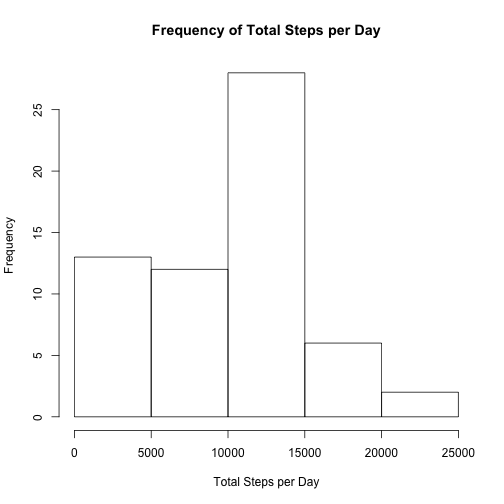
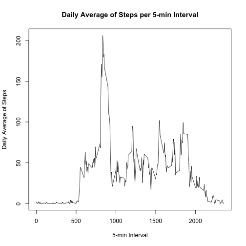
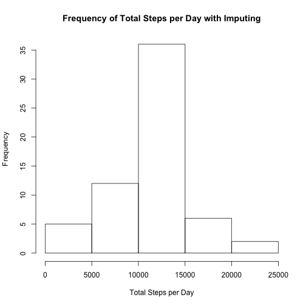
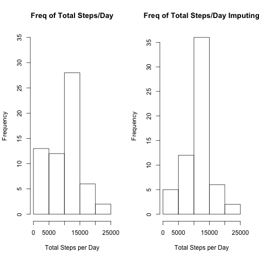
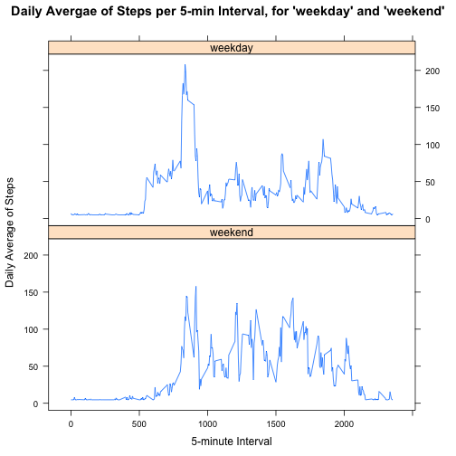

JHU - Reproducible Research - Week 2 - Course Project 1
=========================================================


### "Loading and preprocessing the data"

#### "1. Load the data (i.e. read.csv())"

The data is read with the function read.csv().


```r
activityData <- read.csv("activity.csv", header = TRUE, sep = ",")
```

#### "2. Process/transform the data (if necessary) into a format suitable for your analysis"

First, I took a look at the structure of the data set, i.e. the class of its variables. Then, I convert the "date" variable to class Date.


```r
str(activityData)
```

```
## 'data.frame':	17568 obs. of  3 variables:
##  $ steps   : int  NA NA NA NA NA NA NA NA NA NA ...
##  $ date    : Factor w/ 61 levels "2012-10-01","2012-10-02",..: 1 1 1 1 1 1 1 1 1 1 ...
##  $ interval: int  0 5 10 15 20 25 30 35 40 45 ...
```

```r
activityData$date <- as.Date(activityData$date, format = "%Y-%m-%d")
str(activityData)
```

```
## 'data.frame':	17568 obs. of  3 variables:
##  $ steps   : int  NA NA NA NA NA NA NA NA NA NA ...
##  $ date    : Date, format: "2012-10-01" "2012-10-01" ...
##  $ interval: int  0 5 10 15 20 25 30 35 40 45 ...
```

### "What is mean total number of steps taken per day?"

#### "1. Calculate the total number of steps taken per day"

First, I installed the "data.table" package for easier manipulation of the data set. Then, I used the with() and the tapply() functions to calculate the dotal number of steps for each day and create new data set, with the data.table() function.


```r
library(data.table)

stepsSum <- with(activityData, tapply(steps, date, sum, na.rm = TRUE))
stepsDay <- data.table(Date = names(stepsSum), Steps = stepsSum)

str(stepsDay)
```

```
## Classes 'data.table' and 'data.frame':	61 obs. of  2 variables:
##  $ Date : chr  "2012-10-01" "2012-10-02" "2012-10-03" "2012-10-04" ...
##  $ Steps: int  0 126 11352 12116 13294 15420 11015 0 12811 9900 ...
##  - attr(*, ".internal.selfref")=<externalptr>
```

#### "2. If you do not understand the difference between a histogram and a barplot, research the difference between them. Make a histogram of the total number of steps taken each day"

I created the requied histogram with the hist() function. In addition, I gave it the appropriate labeling.


```r
hist(stepsDay$Steps, xlab = "Total Steps per Day", main = "Frequency of Total Steps per Day")
```



#### "3. Calculate and report the mean and median of the total number of steps taken per day"

The mean and median of the Steps variable are calculated with the functions mean() and median(), respectively.


```r
mean(stepsDay$Steps)
```

```
## [1] 9354.23
```

```r
median(stepsDay$Steps)
```

```
## [1] 10395
```

### "What is the average daily activity pattern?"

#### "1. Make a time series plot (i.e. type = "l") of the 5-minute interval (x-axis) and the average number of steps taken, averaged across all days (y-axis)"

I used the with() and the tapply() functions to calculate the average number of steps and create new data set with the infromation, with the data.table() function. Then I created the plot using the plot() function.


```r
meanSteps <- with(activityData, tapply(steps, interval, mean, na.rm = TRUE))
stepsInterval <- data.table(Interval = names(meanSteps), Steps = meanSteps)

plot(stepsInterval$Interval, stepsInterval$Steps, type = "l", xlab = "5-min Interval",
     ylab = "Daily Average of Steps", main = "Daily Average of Steps per 5-min Interval")
```



#### "2. Which 5-minute interval, on average across all the days in the dataset, contains the maximum number of steps?"

I used the following command, along with the which.max() function in order to determine which 5-minute interval contains the maximum number of steps.


```r
stepsInterval[which.max(stepsInterval$Steps), ]
```

```
##    Interval    Steps
## 1:      835 206.1698
```

### "Imputing missing values"

#### "1. Calculate and report the total number of missing values in the dataset (i.e. the total number of rows with NAs)"

I used the sum() and the is.na() functions to determine the number of NA values within the "steps" variable in the data set.


```r
sum(is.na(activityData$steps))
```

```
## [1] 2304
```

#### "2. Devise a strategy for filling in all of the missing values in the dataset. The strategy does not need to be sophisticated. For example, you could use the mean/median for that day, or the mean for that 5-minute interval, etc."

The strategy that I chose to use, for filling in the missing values, was to replace them with the mean of the "steps" variable. The code bellow shows the use of the ifelse(), the is.na(), and the mean() functions that executed that strategy.

The following commands create a copy of the existing data set and then substitute the NA values with the mena of the "steps" variable through the function ifelse(), as well as the functions is.na() and mean().


```r
activityDataImp <- activityData

activityDataImp$steps <- ifelse(is.na(activityDataImp$steps),
                                mean(activityDataImp$steps, na.rm = TRUE),
                                activityDataImp$steps)
```

#### "3. Create a new dataset that is equal to the original dataset but with the missing data filled in."

The code above, in Step 2, created a new data set with the missing values filled in.

#### "4. Make a histogram of the total number of steps taken each day and Calculate and report the mean and median total number of steps taken per day. Do these values differ from the estimates from the first part of the assignment? What is the impact of imputing missing data on the estimates of the total daily number of steps?"

I used the with() and the tapply() functions to calculate the total number of steps taken each day and create new data set with the infromation, with the data.table() function. Then I created the plot using the hist() function.


```r
stepsSumImp <- with(activityDataImp, tapply(steps, date, sum))
stepsDayImp <- data.table(Date = names(stepsSumImp), Steps = stepsSumImp)

hist(stepsDayImp$Steps, xlab = "Total Steps per Day",
     main = "Frequency of Total Steps per Day with Imputing")
```



The mean and median of the Steps variables are calculated with the functions mean() and median(), respectively. One can notice a slight difference, an increase, in the values from the first part of the assignemnt.


```r
mean(stepsDayImp$Steps)
```

```
## [1] 10766.19
```

```r
median(stepsDayImp$Steps)
```

```
## [1] 10766.19
```

```r
mean(stepsDay$Steps)
```

```
## [1] 9354.23
```

```r
median(stepsDay$Steps)
```

```
## [1] 10395
```

I created a comparison of of the two histograms, the one from the first part of the assignement with the cleaned NA values and the one where the NA values were replaced with the mean of the column/variable.


```r
par(mfrow = c(1, 2))
hist(stepsDay$Steps, xlab = "Total Steps per Day",
     main = "Freq of Total Steps/Day",
     ylim = c(0, 35))
hist(stepsDayImp$Steps, xlab = "Total Steps per Day",
     main = "Freq of Total Steps/Day Imputing")
```



As the compariosn shows, the imputing has caused slight differences within the different 5-minute intervals. Some 5-minute intervals have increase, while some have decreased.

### "Are there differences in activity patterns between weekdays and weekends?"

#### "For this part the weekdays() function may be of some help here. Use the dataset with the filled-in missing values for this part."

#### "1. Create a new factor variable in the dataset with two levels – “weekday” and “weekend” indicating whether a given date is a weekday or weekend day."

Before I created the new factor variable, with the two levels "weekday" and "weekend", I made a copy of the data set. Then, I created the value "weekdays", which contains the strings for wach weekday. As a next step, I used the factor() function to make sure that the new variable will be indeed a factor variable. In the function I used the binary operator %in% to indicate TRUE/FALSE match and thus replace the days of the week with the level "weekday" and the days of the weekend with the level "weekend".


```r
str(activityDataImp)
```

```
## 'data.frame':	17568 obs. of  3 variables:
##  $ steps   : num  37.4 37.4 37.4 37.4 37.4 ...
##  $ date    : Date, format: "2012-10-01" "2012-10-01" ...
##  $ interval: int  0 5 10 15 20 25 30 35 40 45 ...
```

```r
activityDataImp2 <- activityDataImp

weekdays <- c("Monday", "Tuesday", "Wednesday", "Thursday", "Friday")

activityDataImp2$day <- factor((weekdays(activityDataImp2$date) %in% weekdays),
                               levels = c(FALSE, TRUE),
                               labels = c("weekend", "weekday"))
```

The new factor variable is called "day", with two levels - "weekday" and "weekend".


```r
str(activityDataImp2)
```

```
## 'data.frame':	17568 obs. of  4 variables:
##  $ steps   : num  37.4 37.4 37.4 37.4 37.4 ...
##  $ date    : Date, format: "2012-10-01" "2012-10-01" ...
##  $ interval: int  0 5 10 15 20 25 30 35 40 45 ...
##  $ day     : Factor w/ 2 levels "weekend","weekday": 2 2 2 2 2 2 2 2 2 2 ...
```

#### "2. Make a panel plot containing a time series plot (i.e. type = "l") of the 5-minute interval (x-axis) and the average number of steps taken, averaged across all weekday days or weekend days (y-axis). See the README file in the GitHub repository to see an example of what this plot should look like using simulated data."

Here, I used the "dplyr" package and its group_by() and summarise_all() functions to respectively group the new data set by the variables "day" and "interval", and summarise the results by the mean of steps taken each day (weekdays and weekends).


```r
library(dplyr)

activityData2avgSteps <- activityDataImp2 %>%
        group_by(day, interval) %>%
        summarise_all(funs(mean))

head(activityData2avgSteps)
```

```
## # A tibble: 6 x 4
## # Groups:   day [1]
##       day interval    steps       date
##    <fctr>    <int>    <dbl>     <date>
## 1 weekend        0 4.672825 2012-10-31
## 2 weekend        5 4.672825 2012-10-31
## 3 weekend       10 4.672825 2012-10-31
## 4 weekend       15 4.672825 2012-10-31
## 5 weekend       20 4.672825 2012-10-31
## 6 weekend       25 7.922825 2012-10-31
```

I used the "lattice" package and its xyplot() function to plot the comparison of daily average steps by 5-minute interval between weekdays and weekends.


```r
library(lattice)

xyplot(steps ~ interval | day, data = activityData2avgSteps, type = "l",
       layout = c(1, 2), xlab = "5-minute Interval", ylab = "Daily Average of Steps",
       main = "Daily Avergae of Steps per 5-min Interval, for 'weekday' and 'weekend'")
```


